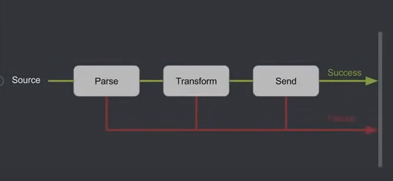

## Controlup Exercise:  <br/>
In data oriented applications we tend to deal with control flows very often.  <br/>
Let's imagine a very simple pipeline flow:
  <br>
* Each step here might have two types of results: Success/Failure  <br>
* **Ideally** we would like to have some design that could chain those two types of results for a "step" into one chain of "steps"  <br/>
* If the step result is successful we want to continue to the next step in the flow, if it is a failure
  we would like our logic to pass to the "failure flow" path (like a train on railways).  <br/> 

## The actual requirements for a successful flow:  <br/>
* Read the raw data from source (the sources is mocked with pojos)  <br/>
  *RawUser(fullName,email,phone,streetAddress,city,zipCode)*  <br/>
  Example: ```RawUser("Roth Drake", "vestibulum.nec@eratEtiam.net", "1-230-665-4456", "P.O. Box 980, 4942 Mattis. St.", "Gellik", "10691")``` <br/>
  You can create yourself a function which mocks the source by returning a sequence of <em>RawUser</em> objects.  <br/>
* You should have a step which transforms the <em>RawUser</em> to <em>Person</em>. A general Person structure is <em>Person(firstName,lastName)</em>  <br/>
  We should also create a <em>```PhoneNumber("1","230-665-4456")```</em> object out of a phone number string.
* We would also like to have a "result" step which counts the successes and returns the result.  <br/>
* The last step just prints the returned value

## The actual requirements for failed flow:  <br/>
* Read the raw data from source (the sources is mocked with pojos)  <br/>
  Pojo: ```RawUser("Roth Drake", "vestibulum.nec@eratEtiam.net", "1-230-665-4456", "P.O. Box 980, 4942 Mattis. St.", "Gellik", "10691")``` <br/>
* In case of a failure in transforming a `RawUser` to `Person` ,move to "result" step.  <br/>
* In case of a failure in transforming a `RawUser`'s phone number to a `PhoneNumber` , move to "result" step.  <br/>
* The "result" step counts the failures and returns the result.
* The last step just prints the returned value.

## Design guidelines:  <br/>
A preferred design would be one which implements both flows (success and failure) under one logical flow.  <br/>
A hint - In order to achieve the above goal, one better to figure out some type which abstracts over a 'Success' and 'Failure'.  <br/>
We would also prefer a more *functional* solution which means preferring *pure functions* (if not familiar with a concept please read on the internet).  <br/>
A more functional approach in general means: no exceptions throwing, no changing any state outside a function, preferring immutability to mutability.


### In case you can provide some proofs that the code works, we would appreciate it very much :) 

  
